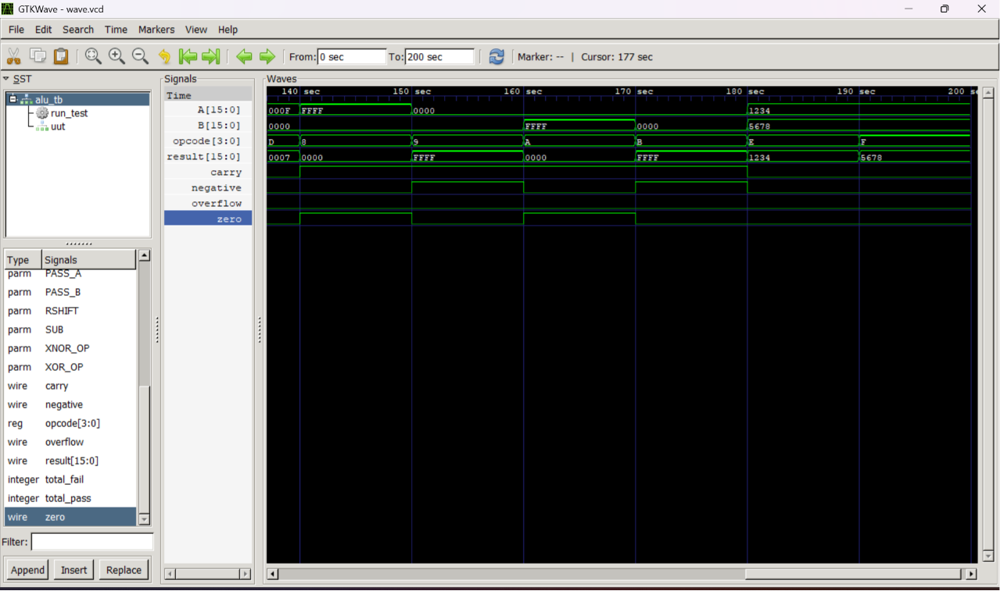

# Parameterized Behavioral ALU in Verilog

A parameterized **N-bit Arithmetic Logic Unit (ALU)** implemented using **Behavioral Modeling** in Verilog HDL.

The ALU supports **16 different operations**, generates status flags, and is verified using a reusable task-based self-checking testbench.

---

## Features

- Parameterized data width (Default: 16-bit)
- Behavioral Modeling
- 16 ALU Operations
- Carry Flag
- Overflow Flag
- Negative Flag
- Zero Flag
- Reusable Task-Based Testbench
- GTKWave Simulation

---

## Supported Operations

| Opcode | Operation |
|:------:|-----------|
| `0000` | Addition |
| `0001` | Subtraction |
| `0010` | AND |
| `0011` | OR |
| `0100` | XOR |
| `0101` | XNOR |
| `0110` | NOT A |
| `0111` | NOT B |
| `1000` | Increment A |
| `1001` | Decrement A |
| `1010` | Increment B |
| `1011` | Decrement B |
| `1100` | Logical Left Shift |
| `1101` | Logical Right Shift |
| `1110` | Pass A |
| `1111` | Pass B |

---

## Status Flags

- Carry
- Overflow
- Negative
- Zero

---

## Project Structure

```
Parameterized-Behavioral-ALU
│
├── rtl/
│   └── alu.v
│
├── tb/
│   └── alu_tb.v
│
├── waveform.png
├── README.md
└── .gitignore
```

---

## Simulation

The ALU was simulated using **Icarus Verilog** and verified using **GTKWave**.

### Waveform



---

## Tools Used

- Verilog HDL
- Visual Studio Code
- Icarus Verilog
- GTKWave
- Git
- GitHub

---

## Learning Outcomes

Through this project I learned:

- Behavioral Modeling in Verilog
- Parameterized Module Design
- Combinational ALU Design
- Status Flag Generation
- Task-Based Testbench Development
- Directed Verification
- Git and GitHub Workflow

---

## Future Improvements

- Barrel Shifter
- Arithmetic Shift Operations
- Rotate Left / Rotate Right
- Multiplication and Division
- Randomized Testbench
- SystemVerilog Assertions

---

## Author

**Sannith**

B.Tech Electronics and Communication Engineering